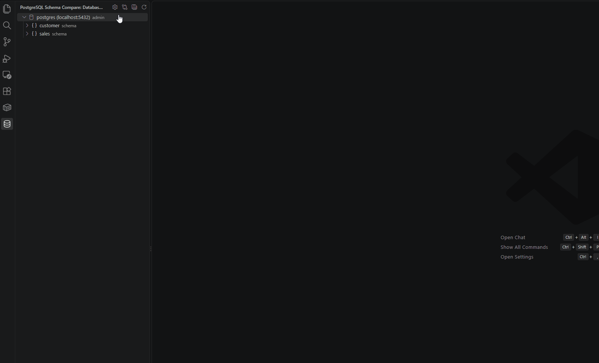
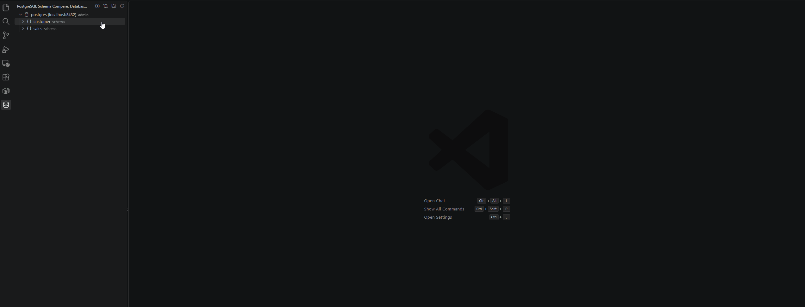

# PostgreSQL Schema Compare

Compare a live PostgreSQL database with local SQL files, review the differences, and sync either side from Visual Studio Code.

## Workflows

### 1. Configure, explore, and write schema files

Choose a schema folder, enter and test your PostgreSQL connection, then save the settings. Browse schemas and objects in **Database Objects** and select **Write Database to Folder** to create local SQL files.



### 2. Compare, review a migration plan, and update

Open **Schema Folder vs Database** to inspect differences. Compare an object, preview its migration SQL, or update the folder or live database.



## Quick start

1. Open the **PostgreSQL Schema Compare** activity bar view and select **Configure Connection**.
2. Enter the host, port, database, username, and password. Choose a local **Schema folder** with the folder button, or type its path. Selecting a folder saves that path immediately; typed paths and database details are saved with **Save Settings**.
3. Select **Test Connection**, then **Save Settings**. The database appears in **Database Objects**.
4. Select **Write Database to Folder** from the view title or the database's right-click menu to create local `.sql` files.
5. Select **Compare Folder with Database** from the view title to review the whole folder against the live database.

The folder picker starts in your home directory. You can navigate to any folder; choosing another folder replaces the saved schema folder path.

## What you can do

| Action | Result |
| --- | --- |
| **Write Database to Folder** | Export supported database objects into the configured schema folder. Matching files are overwritten after confirmation. |
| **Compare with Live Database** | Open a VS Code diff for a local `.sql` file or a database object. |
| **Compare Folder with Database** | Open the comparison webview for every supported object in the folder and database. |
| **Migration Plan** | Preview generated SQL for one difference or all visible actionable differences. |
| **Update Folder** | Change local files to match the live database. |
| **Update Database** | Apply local SQL or a generated migration plan to the live database. |

The comparison view filters by schema, object type, and status. Its bulk actions apply to the differences currently shown by those filters. Each row has its own **Compare**, **Migration Plan**, **Update Folder**, and **Update Database** actions where applicable. After an update, completed rows are removed and affected explorer folders refresh.

### Compare an individual object

- Right-click a local `.sql` file in the VS Code file explorer and select **Compare with Live Database**.
- Select or right-click an object in **Database Objects** and choose **Compare with Live Database**.
- From an open diff, use the editor title actions to **Swap Compare Direction**, **Update Folder from Live Database**, or **Update Live Database from Folder**.

Tables use a table-aware comparison, so changing only the order of columns does not create a difference.

### Browse and manage the connection

**Database Objects** groups tables, views, materialized views, indexes, functions, procedures, sequences, triggers, and types by schema. Open a schema and object folder to load comparison results. Object folders show `no diff` and `diff` counts; objects can show `same`, `modified`, `missing local`, `local only`, or `compare error`.

Right-click the database connection and choose **Remove Connection** to disconnect and clear its saved host, database, username, and password without a prompt. The port resets to `5432`, and the schema folder remains configured. The same action is available on a failed connection row. To connect again, choose **Configure Connection**.

You can also refresh the view or individual object folders from the live database. **Reveal in File Explorer** opens the matching local folder for a connection, schema, object folder, or object.

## Migration plans and update direction

**Update Folder** uses the database definition as the source and changes local files. **Update Database** uses local files as the source and changes the live database. Review the generated SQL before applying a database update.

For modified tables, the standard plan uses `ALTER TABLE` where supported: columns, types, defaults, `NOT NULL`, and named constraints. It handles affected foreign keys by dropping and restoring them around the table changes. Text-like columns changed to `jsonb` use a `USING` clause.

For a modified table, a separate **Drop and Recreate Table** plan is available. It removes table rows and may lose database properties or dependent objects that are absent from local SQL. PostgreSQL can also block the drop when other objects depend on the table. Preview this plan before using its **Update Database** action; the extension asks for data-loss confirmation.

Combined plans create schemas and prerequisite types and sequences before tables and deferred foreign keys where practical. Modified non-table objects use supported drop-and-create plans. The header menu can generate a plan or update all currently visible actionable differences, including the table recreation variant when relevant.

## Local folder layout

The preferred structure is one folder per PostgreSQL schema, then one folder per object type:

```text
schema/
  public/
    Tables/
      users.sql
    Views/
      active_users.sql
    Materialized Views/
    Indexes/
    Functions/
    Procedures/
    Sequences/
    Triggers/
    Types/
  app/
    Tables/
    Views/
```

Set `postgresSchemaCompare.schemaFolder` to `schema` for this example. Dot-prefixed schema folders and SQL files are ignored during local scans.

## Configuration

Open **Configure Connection** from the extension sidebar. Settings are saved in the current workspace when one is open, or in user settings otherwise.

| Setting | Purpose |
| --- | --- |
| `postgresSchemaCompare.host` | PostgreSQL server host. |
| `postgresSchemaCompare.port` | PostgreSQL server port; defaults to `5432`. |
| `postgresSchemaCompare.database` | Database name. |
| `postgresSchemaCompare.username` | PostgreSQL username. |
| `postgresSchemaCompare.password` | PostgreSQL password. Keep workspace settings containing passwords out of source control. |
| `postgresSchemaCompare.schemaFolder` | Local schema folder, as an absolute path or a path relative to the workspace. |

## Requirements

- Visual Studio Code `1.90.0` or newer.
- A reachable PostgreSQL database.
- A workspace folder for a relative schema path. An absolute schema folder path works without an open workspace.

## Development

```bash
npm install
npm test
```

Use `npm run compile` to compile without running tests. See [changelog.md](changelog.md) for release details.
